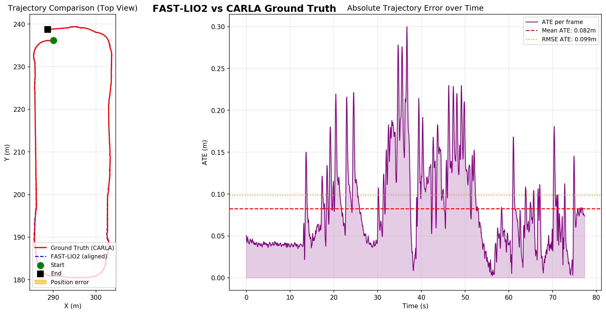

# FastLIO2-CARLA

This ROS package is designed to adapt and integrate [FAST_LIO2](https://github.com/hku-mars/FAST_LIO) with the [CARLA Simulator](https://carla.org/).

It resolves common issues with running FastLIO2 directly on simulated point clouds coming from CARLA by fixing LIDAR timestamps and providing necessary coordinate frame transformations. 

## Localization Accuracy



## Included Nodes/Scripts
- `lidar_timestamp_fix_node.py`: Fixes the timestamp of point clouds from CARLA to ensure compatibility with FastLIO2.
- `map_to_init_tf.py`: Publishes the TF transform from the `map` frame to the FastLIO2 `camera_init` frame.
- `pcl_to_gridmap.py`: Converts point cloud data into a 2D occupancy grid map.

## Prerequisites
- [ROS Noetic](http://wiki.ros.org/noetic) (or Melodic)
- [CARLA Simulator](https://carla.org/)
- [carla-ros-bridge](https://github.com/carla-simulator/ros-bridge)

## Installation

1. Create a catkin workspace (if you haven't already):
```bash
mkdir -p ~/catkin_ws/src
cd ~/catkin_ws/src
```

2. Clone FAST_LIO2 、carla-ros-bridge and this repository into `src`:
```bash
git clone https://github.com/Livox-SDK/livox_ros_driver.git # driver for fastlio2
git clone https://github.com/hku-mars/FAST_LIO.git
git clone https://github.com/LadissonLai/ros-bridge.git -b feat/parking
git clone https://github.com/LadissonLai/FastLIO2-CARLA.git # this repo
```

3. Build the workspace:
```bash
cd ~/catkin_ws/src
cd FAST_LIO
git submodule update --init
cd ../../
catkin_make
source devel/setup.bash
```

## Launching

1. Make sure CARLA simulator and `carla-ros-bridge` are running:
```bash
# In one terminal, launch CARLA
# ./CarlaUE4.sh

# In another terminal, launch the ROS bridge and spawn a vehicle with a LIDAR
# roslaunch carla_ad_demo parking.launch
```

2. Run the `fastlio2_carla` launch file:
```bash
roslaunch fastlio2_carla carla_fastlio2.launch
```

This will bring up the FastLIO2 algorithm configured with RViz for visualization, along with the necessary timestamp fix and TF publisher nodes.
